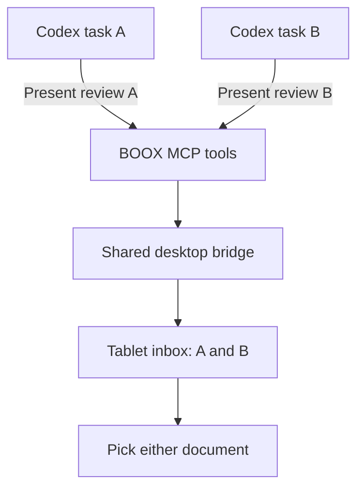
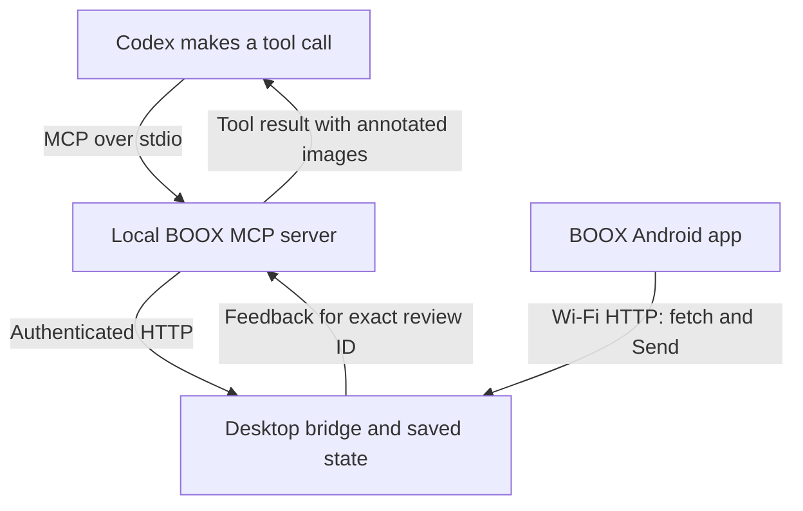
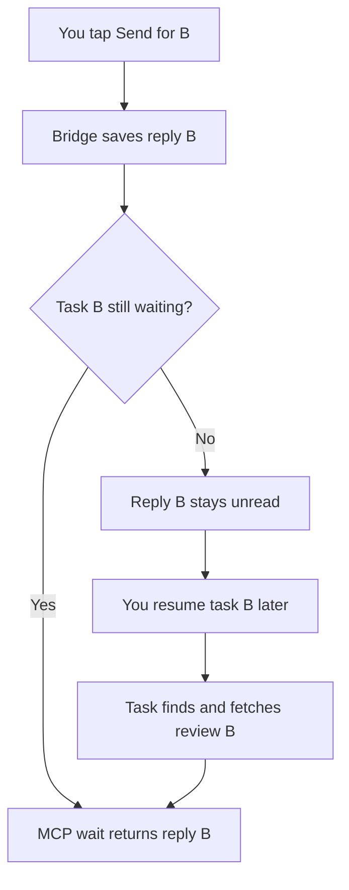

# How BOOX replies reach their Codex task

Current implementation, v0.8.0. Multiple Codex tasks share one tablet inbox. Each document has its own permanent review ID. Replies are retrieved by that ID, regardless of which document you opened first or how many hours passed.

The important limit: BOOX Send saves your reply, but does not automatically wake an idle Codex task. An active or resumed task must collect it.

## One inbox, separate conversations

New documents join the queue without replacing your current ink. You can select any pending document from Documents. Queue order controls reading order only. It never decides which Codex task receives feedback.

## The address attached to each document

The bridge stores a review ID, optional originating task ID and workspace, plus the source file path and SHA-256 checksum. Markdown pages also retain source line ranges and an immutable source snapshot.

For example, task A sends design.md as review A. Task B sends budget.md as review B. If you review B first, its pen strokes remain attached to review B and budget.md. They do not become a reply to whichever Codex task happens to be visible on your desktop.

Task identity must be supplied correctly. boox_present accepts origin_thread_id and origin_workspace. It can fall back to CODEX_THREAD_ID and the MCP process working directory. Explicit values are safer when one server serves several tasks. If identity is missing, the agent must use its retained review ID and source context; it must not guess from a title.

## What actually carries the message?

MCP is the tool interface used by Codex. The Android app uses the bridge's HTTP API; it does not speak MCP and runs no LLM. The skill tells Codex when to present, wait, inspect handwriting and update the source.

For this task, an existing local SDK client invokes the real MCP server because BOOX tools are not directly exposed in this task's tool list. The review and feedback use the same bridge and IDs.

## Example: you reply three hours later

At 09:00, task A calls boox_present and retains review A's ID. At 09:05, task B sends review B. At noon, you select B, annotate its pages and tap Send once.

The tablet freezes the submission with a stable submission ID. The bridge saves all pages together before confirming receipt. If confirmation is lost, retrying the identical submission is safe. Local drafts and retry data protect against temporary network failures.

An active task calls boox_wait_feedback with its own review ID. Each call waits at most 45 seconds. A timeout means pending; the task repeats the call without creating another review. Several hours do not expire a pending review.

## Recovering after a task stops

On a later turn, the skill directs the task to call boox_feedback_inbox. This lists unread submissions across the shared bridge. The task matches origin.threadId, workspace, its retained review IDs and source context, then fetches the exact review with boox_wait_feedback.

Routing here is agent-side matching. The bridge does not enforce per-task ownership or push replies into separate conversations. Clients share bridge credentials. Correct origin metadata and following the skill prevent mix-ups; this is not a security boundary between tasks.

After reading every annotated page, Codex calls boox_acknowledge_feedback with both review ID and submission ID. This marks the submission read. It does not approve the document or apply edits. Codex then reconciles the source checksum and snapshot before changing the original Markdown, preserving any newer edits.

Feedback arrives as a tool result containing images, strokes and metadata. It is not injected as a new user-role chat message. The active Codex turn interprets your handwritten intent and continues the conversation.

## What works, and what still needs work

Durable queueing, delayed collection, exact review lookup, source snapshots and explicit read acknowledgement work now. Submitted reviews remain in History for 90 days by default, including unread ones. Pending reviews do not expire under that history rule.

Automatic continuation of an idle desktop task is still missing. The bridge currently has no verified connection that starts a turn in the originating desktop task. Android notifications only alert you about new documents; they do not wake Codex.

A future delivery adapter would need a supported desktop connection, verified task identity, a durable delivery record and retry reconciliation. Saving a task ID alone does not provide that adapter.

For now: annotate whenever convenient, tap Send, then resume the requesting Codex task if it has stopped. Ask it to collect BOOX feedback. Your reply remains attached to the original review while it waits.

Implementation references: src/mcp.js, src/store.js, src/bridge.js, skills/boox-review/SKILL.md and docs/feedback-continuation.md. These describe this project's current behavior, not a guarantee about every Codex integration.
