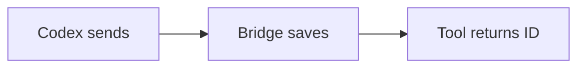
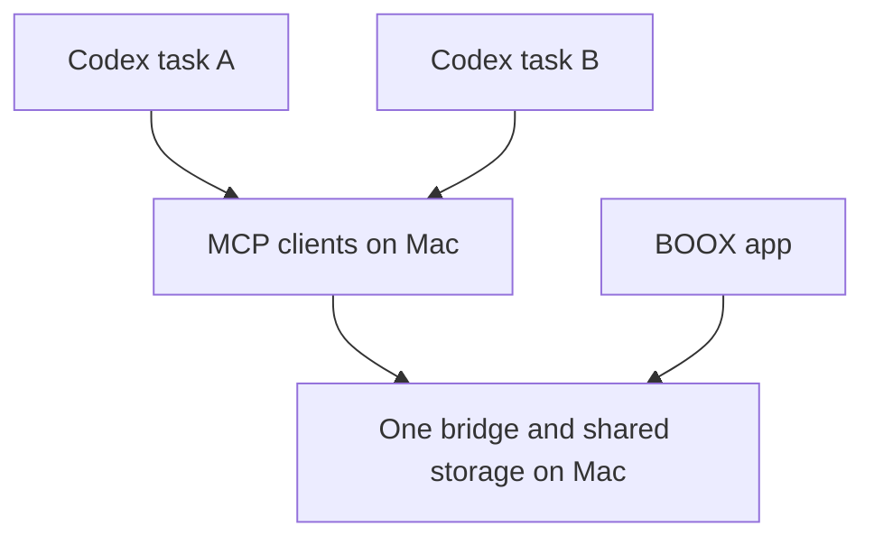

# Answers to your BOOX notes

Reviewed all seven submitted pages. You accepted manual continuation and shared storage. Automatic task wake-up is out of scope. Review checks now default to zero seconds, with no repeated waiting unless you explicitly ask for a live session.

## Who waits, and for what?

boox_present renders and queues a document, then returns its review ID. It does not wait for handwriting. Codex can end its turn after delivery; you can review hours later.

boox_wait_feedback is a separate call. It now checks immediately by default. A pending result means your comments have not arrived. The earlier 45 seconds was a maximum duration for one tool call, never a deadline for your review. Only an explicitly requested live session uses repeated waits.

Later, you tap Send on BOOX. The bridge stores your annotated pages. When you ask the originating task to review feedback, it fetches the matching review ID and receives images through a tool result.

## Where does the bridge live?

The bridge is a separate Node process on your Mac. macOS runs it through a LaunchAgent named com.olblinov.boox-review. It is outside the Codex task process and can keep storing documents while a task is idle.

Its code is in this project's src/bridge.js. Persistent review state is in this project's .runtime/state.json. Immutable Markdown snapshots live in .runtime/documents. These private runtime files are excluded from Git.

Yes, tasks configured for this bridge read from one shared store. The MCP server is an adapter between tool calls and the bridge's HTTP API. Several MCP processes can use the same bridge. Queue position never determines reply ownership.

Every review has a unique review ID. Originating task ID and workspace, source path and checksum help a resumed task select its own submission. The bridge does not enforce task isolation; the agent matches these fields before reading and acknowledging comments.

## Use it from a new Codex task

The boox-review skill is installed for your user. The BOOX MCP server is configured in your Codex configuration. In a new task, say:

> Use $boox-review. Send this document to my BOOX for asynchronous review. Keep its review ID and this task's origin. Do not wait for my reply.

After reviewing on BOOX and tapping Send, return to that same task and say:

> Review my BOOX feedback and apply my comments.

The skill supplies the workflow. MCP supplies tools such as boox_present, boox_feedback_inbox, boox_wait_feedback and boox_acknowledge_feedback. You do not need to type tool calls yourself.

If a task cannot discover BOOX tools, it must report that connection problem. Configuration alone does not prove tools are available in an already-open task. This task has used an existing local SDK client to call the real MCP server.

## Pen strokes and queue removal

Your report describes a display bug: early strokes disappear until more writing arrives, and earlier words sometimes turn grey. The native ink layer and Android's retained page drawing need a reliable handoff after pen-up. The fix must preserve low-latency writing and repaint completed strokes from saved stroke data. Device installation alone cannot prove the intermittent physical-pen symptom is resolved; that needs handwriting verification.

Documents now provides Remove beside each queued item. Confirmation cancels that review without submitting comments. Removing the final pending document leads to Empty inbox. Removal affects the shared queue, so every task sees that review as cancelled. Submitted History is separate. An uncertain Send must be retried before removal.
