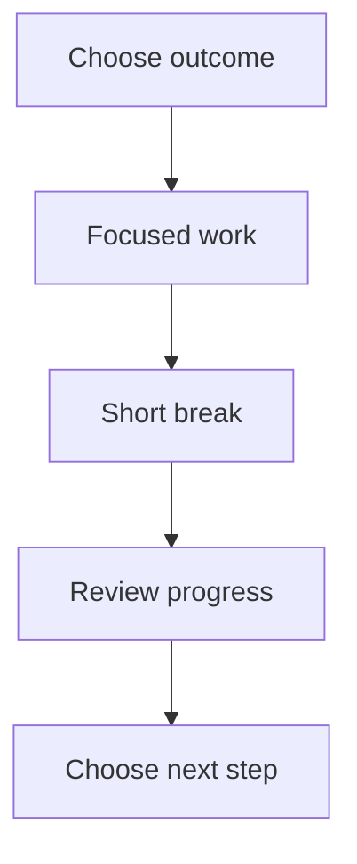

# Plan a focused morning

Review this draft. Mark changes directly beside text, or sketch an alternative in the surrounding space.

## Proposed schedule

| Time | Activity |
| --- | --- |
| 09:00 | Choose one useful outcome |
| 09:15 | Work without interruptions |
| 10:00 | Take a short break |
| 10:15 | Review progress and adjust |

## Decisions to test

Keep the first work block at 45 minutes. Silence notifications during that block. Leave email until after the break.

Circle any time you would change. Cross out anything unnecessary. Write replacement wording nearby.

## Sketch a better flow

Change the diagram if your preferred routine differs. Add a missing step or draw a new connection.

## Finish review

Browse every page. Add any final notes, then tap Send document once. Your annotated copy stays in History for 90 days.
